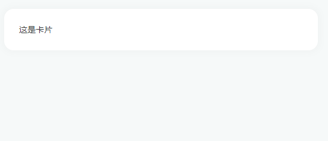
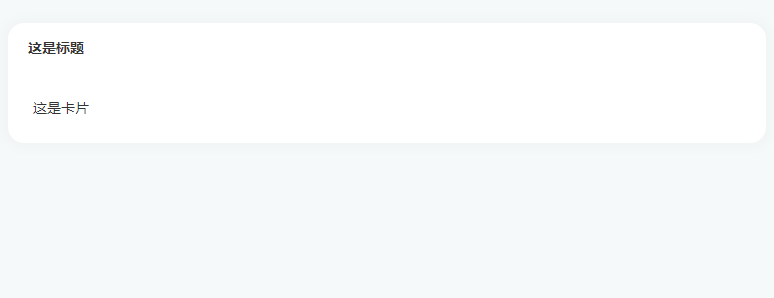
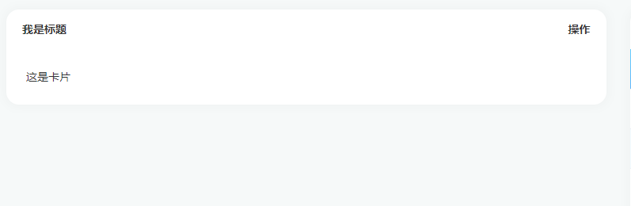

# Card 卡片

### 简单卡片

只包含内容

```vue
<asp-card>这是卡片</asp-card>
```

### 样例视图



<hr/>

### 带头部卡片

包含头部和内容

#### 1、带参数

```vue
<asp-card header="这是标题">这是卡片</asp-card>
```

### 样例视图



<hr/>

#### 2、slot 自定义

```vue
<asp-card>
  <div slot="header" style="display: flex; justify-content: space-between">
    <span>我是标题</span>
    <span>操作</span>
  </div>
  这是卡片
</asp-card>
```

图例：



<hr/>

### Attributes

参数 | 说明 | 类型 | 可选值 | 默认值
---|---|---|---|---
header | 设置 header，也可以通过 slot#header 传入 DOM | string | — | —
body-style | 设置 body 的样式 | object | — | { padding: '20px' }
shadow | 设置阴影显示时机 | string | always / hover / never | always

