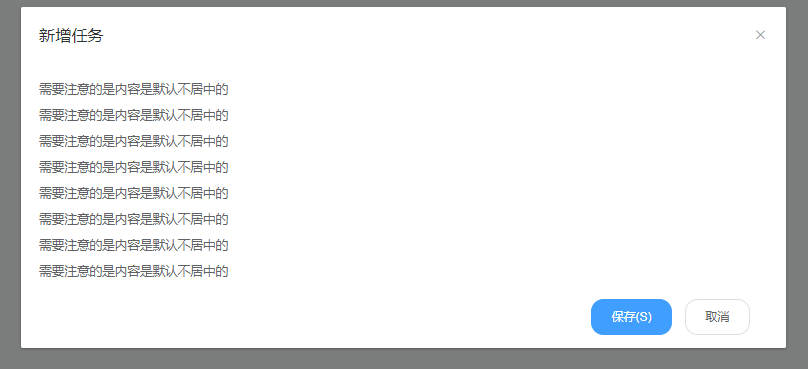

# Dialog 弹出窗组件

### 基本用法

Dailog 弹出一个对话框

### 样例视图




### 主代码

```vue
<template>
  <div>
    <button @click="click">点击</button>312312321
    <!--弹出框-->
    <asp-dialog v-bind="dialogOption"
               @close="closeDynamicDialog"
               :view.sync="dialogOption.view"
               :visible.sync="dialogOption.show">
      <component :is="dialogOption.view"
                 :dialog-data="dialogData"
                 @close="closeDynamicDialog">
      </component>
    </asp-dialog>
  </div>
</template>

<script>
  import com from './com.vue'
  export default {
    components: {
      com
    },
    data () {
      return {
        dialogOption: {
          show: false,
          view: null,
          title: '',
          width: '1200px'
        },
        dialogData: {}
      }
    },
    methods: {
      click () {
        this.showDynamicDialog('com', '新增任务', '850px')
      },
      showDynamicDialog (view, title, width = '1200px') {
        this.dialogOption.show = true
        this.dialogOption.view = view
        this.dialogOption.title = title
        this.dialogOption.width = width
      },
      closeDynamicDialog (boolean) {
        if(boolean) {
          // 关闭弹窗后刷新列表
          // this.fetchData()
        }
        this.dialogOption = {
          show: false,
          view: null,
          title: '',
          width: '0px'
        }
      }
    }
  }
</script>

<style scoped>

</style>

```


### 组件 com.vue

```vue
<template>
  <div>
    <div>
      <p>需要注意的是内容是默认不居中的</p>
      <p>需要注意的是内容是默认不居中的</p>
      <p>需要注意的是内容是默认不居中的</p>
      <p>需要注意的是内容是默认不居中的</p>
      <p>需要注意的是内容是默认不居中的</p>
      <p>需要注意的是内容是默认不居中的</p>
      <p>需要注意的是内容是默认不居中的</p>
      <p>需要注意的是内容是默认不居中的</p>
    </div>
    <div class="el-dialog__footer">
      <el-button type="primary">保存(S)</el-button>
      <el-button @click="$emit('close')">取消</el-button>
    </div>
  </div>
</template>

<script>
export default {
}
</script>

<style scoped>

</style>

```

<hr/>

### Attributes for dialogOption 

参数 | 说明 | 类型 | 可选值 | 默认值
---|---|---|---|---
show | 是否显示弹出窗 | boolean | true/false | false
view | 组件名 | Boolean | — | —
title | 弹出窗title | string | — | —
width | 弹出窗宽度 | string | — | —

### Events

事件名 | 说明 | 参数 
---|---|---|---|---
close | 关闭弹出窗 | —
