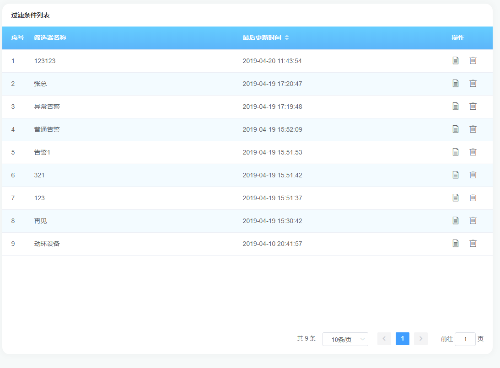
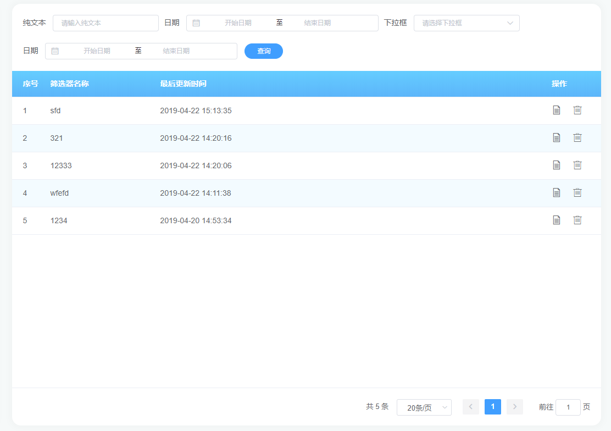

# Query-Table

## 介绍

::: tip 优势
当团队逐渐变大时，就不得不考虑几个问题。代码规范、ui规范。使用 query-table， 我们不用去考虑这些问题，甚至你完全不用去考虑
ui的层面，你只需要考虑数据，只要数据对了，生成的页面就是正确的。
:::

::: warning 温馨提示
基于各位同学的各种业务需求，新增了几个http相关的方法：

1、请求前操作

beforeHttp: (data) => {
  console.log(data)
}

2、请求后操作 tableData -> 表格数据  allData -> 后台返回所有数据

afterHttp: (tableData, allData) => {
  console.log(tableData)
  console.log(allData)
}

3、如果想主动选中表格某些行，可进行如下操作(仅供思路参考)：

this.$refs.queryTable.$refs.tableList.$refs.table.toggleRowSelection(rows)

4、主动请求方法  // 选填：（parmas => 参数） 根据场景使用

this.$refs.queryTable.loadTable(parmas)
:::

下面让我们一一探索

## 用法1：只有表格和分页

### 样例视图



### HTML

```vue
<template>
   <query-table ref="queryTable" 
                :tables="tables"></query-table>
</template>
```

### JAVASCRIPT

<br/>

```js
export default {
    data () {
        return {
            // 列表
            tables: {
              // 请求地址详情
              url: {
                type: 'POST',
                method: '/v1/alertFilterCondition/list',
                addNamespace: false, // true: 带上namespace  false:不带上namespace
                obj: Obj  // 如果有参数请带上参数 无参数可以不传
              },
              // 表格选项
              options: {
                type: 'index',  // index:只显示序号  // selection：显示选择框
                page: true,  // 是否显示分页
                // 请求前操作
                beforeHttp: (data) => {
                  console.log(data)
                },
                // 请求后操作 tableData -> 表格数据  allData -> 后台返回所有数据
                afterHttp: (tableData, allData) => {
                  console.log(tableData)
                  console.log(allData)
                },
                // 选中后操作
                selectionChange: row => {
                  console.log(row)
                }
              },
              // 表头配置
              columns: [
                {
                  label: '筛选器名称',
                  key: 'filterName'
                },
                {
                  label: '最后更新时间',
                  key: 'updateTime',
                  sort: true  // 是否需要排序 ？ true : false
                }
              ],
              // 右侧操作配置
              operation: {
                fixed: 'right',
                label: '操作',
                width: '100px',
                // 操作数量
                options: [
                  {
                    label: '详情',
                    icon: 'iconfont iconwenjian',
                    type: 'icon', // icon 只是图标
                    func: row => this.handleUpdate(row)  // 回调
                  },
                  {
                    label: '删除',
                    icon: 'iconfont icondelete',
                    type: 'button',  // button 按钮
                    func: row => this.handleDelete(row)
                  }
                ]
              },
              // 自定义列输出  例如：后端返回的数据是 10，前端想显示 10% 则如下操作
              formatter: {
                  // 字段名请与上面columns key 名称 一致
                  filterName: (row) => {
                    console.log(row)
                    return `${row.filterName}%`
                  }
              }
            }
        }
    },
    methods: {
        // 点击修改
        handleUpdate (row) {
          console.log(row)
        },
        // 点击修改
        handleDelete (row) {
            console.log(row)
        },
    }
}
```

## 用法2：表单、表格和分页

### 样例视图



### HTML

```vue
<template>
   <query-table ref="queryTable" 
                :form-fields="formFields"
                :tables="tables"></query-table>
</template>
```


### 主动请求方法：this.$refs.queryTable.loadTable(parmas)

### JAVASCRIPT

<br/>

```js
export default {
    data () {
        return {
            // 列表
            tables: {
              // 请求地址详情
              url: {
                type: 'POST',  // POST or GET
                method: '/v1/alertFilterCondition/list', // 请求的接口
                addNamespace: false, // true: 带上namespace  false:不带上namespace
                // obj: Obj  // 如果有参数请带上参数 无参数可以不传
              },
              // 表格选项
              options: {
                type: 'index',  // index:只显示序号  // selection：显示选择框
                page: true,  // 是否显示分页
                // 请求前操作
                beforeHttp: (data) => {
                  console.log(data)
                },
               // 请求后操作 tableData -> 表格数据  allData -> 后台返回所有数据
                 afterHttp: (tableData, allData) => {
                    console.log(tableData)
                    console.log(allData)
                 },
                // 选中后操作
                selectionChange: row => {
                  console.log(row)
                }
              },
              // 表头配置
              columns: [
                {
                  label: '筛选器名称',
                  key: 'filterName'
                },
                {
                  label: '最后更新时间',
                  key: 'updateTime',
                  sort: true  // 是否需要排序 ？ true : false
                }
              ],
              // 右侧操作配置
              operation: {
                fixed: 'right',
                label: '操作',
                width: '100px',
                // 操作数量
                options: [
                  {
                    label: '详情',
                    icon: 'iconfont iconwenjian',
                    type: 'icon', // icon 只是图标
                    func: row => this.handleUpdate(row)  // 回调
                  },
                  {
                    label: '删除',
                    icon: 'iconfont icondelete',
                    type: 'button',  // button 按钮
                    func: row => this.handleDelete(row)
                  }
                ]
              },
              // 自定义列输出  例如：后端返回的数据是 10，前端想显示 10% 则如下操作
              formatter: {
                  // 字段名请与上面columns key 名称 一致
                  filterName: (row) => {
                    console.log(row)
                    return `${row.filterName}%`
                  }
              }
            },
            // 表单配置 详情请看 query-form组件文档
            formFields: [
              {
                label: '纯文本',
                type: 'text',
                placeholder: '请输入纯文本',
                columnName: 'text'
              },
              {
                label: '日期',
                type: 'daterange',
                placeholder: '请选择日期范围',
                columnName: 'daterange'
              },
              {
                label: '下拉框',
                type: 'select',
                placeholder: '请选择下拉框',
                columnName: 'select',
                options: [
                  {
                    value: 123,
                    label: 123
                  }
                ]
              },
              {
                label: '日期',
                type: 'daterange',
                placeholder: '请选择日期范围',
                columnName: 'daterange'
              }
            ]
        }
    },
    methods: {
        // 点击修改
        handleUpdate (row) {
          console.log(row)
        },
        // 点击修改
        handleDelete (row) {
            console.log(row)
        },
    }
}
```


<hr/>

### Attributes

参数 | 说明 | 类型 | 可选值 | 默认值
---|---|---|---|---
formFields | 详情请看[query-form](https://aspire-coding.github.io/aspire-docs/guide/components/query-form.html#attributes)文档 | Array | — | —
tables | 表格参数 | object | — | —

### Tables Attributes

参数 | 说明
---|---
url | 表格接口参数配置
options | 表格配置选项
columns | 表头配置
operation | 固定列配置
formatter | 自定义列输出  例如：后端返回的数据是 10，前端想显示 10%

## Tables 参数详解

```js
export default {
    data () {
        return {
            tables: {
             // 请求地址详情
              url: {
                type: 'POST',
                method: '/v1/alertFilterCondition/list',
                addNamespace: false, // true: 带上namespace  false:不带上namespace
                obj: null  // 如果有参数请带上参数 无参数可以不传
              },
              // 表格选项
              options: {
                type: 'index', // index:只显示序号  // selection：显示选择框
                page: true, // 是否显示分页
                // 请求前操作 以下方法未使用可删除
                beforeHttp: (data) => {
                  console.log(data)
                },
                // 请求后操作 tableData -> 表格数据  allData -> 后台返回所有数据
                 afterHttp: (tableData, allData) => {
                     console.log(tableData)
                     console.log(allData)
                 },
                // 选中后操作
                selectionChange: row => {
                  console.log(row)
                }
              },
              // 表头配置
              columns: [
                {
                  label: '筛选器名称', // 表头显示
                  key: 'filterName', // 列表字段
                  width: '200px', // 列宽度
                  copy: true,  // 是否可复制
                  sort: true  // 是否需要排序 ？ true : false
                },
                {
                  label: '最后更新时间',
                  key: 'updateTime',
                  type: 'btn-text', // 可点击按钮
                  func: (row) => {} // 点击后回调函数
                }
              ],
             // 右侧固定列操作配置
              operation: {
                fixed: 'right', // 固定的位置
                label: '操作', // 表头字段
                width: '100px', // 固定列宽度
                // 固定列配置
                options: [
                  {
                    label: '详情', // label
                    icon: 'iconfont iconwenjian', // 图表
                    type: 'icon', // 类型  icon  / button
                    // disabled: true,  // 该按钮是否可操作 
                    // 1、不可操作： true
                    // 2、可操作 : false or 不配置   
                    // 也可通过回调函数方式动态配置
                    disabled: row => {
                        if (row.a > 1) {
                            return true
                        }
                        return false
                    }, 
                    func: row => this.handleUpdate(row) // 点击事件
                  },
                  {
                    label: '删除',
                    icon: 'iconfont icondelete',
                    type: 'icon',
                    func: row => this.handleDelete(row)
                  }
                ]
              },
              // 自定义列输出  例如：后端返回的数据是 10，前端想显示 10% 则如下操作
              formatter: {
                  // 字段名请与上面columns key 名称 一致
                  filterName: (row) => {
                    console.log(row)
                    return `${row.filterName}%`
                  }
              }
            }
        }
    }
}
```


