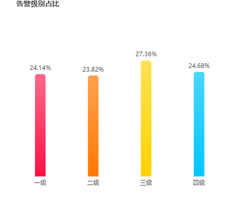

# Echarts 使用教程

### 入门

```npm
## 安装
npm install echarts --save

## 引入
import echarts from 'echarts'
```

### 案例

```vue
<template>
  <div ref="pie"
       class="right-chart"></div>
</template>

<script>
  // 按需加载
  import echarts from 'echarts/lib/echarts'
  import 'echarts/lib/chart/pie'

  export default {
    name: 'charts-level-report',
    data () {
      return {
        chart: null
      }
    },
    mounted () {
      this.fetchData()
    },
    beforeDestroy () {
      if (!this.chart) {
        return
      }
      this.chart.dispose()
      this.chart = null
    },
    methods: {
      // 站点级别分析
      async fetchData (obj = {}) {
        try {
          const data = await this.$http.sendRequest({
            method: 'GET',
            url: '/v1/alerts_report/getAlertLevelReport',
            params: obj
          })
          let xAxisData = []
          let seriesData = []
          let total = 0
          data.forEach((item) => {
            xAxisData.push(item.level)
            seriesData.push(Number(item.value))
            total += Number((item.value))
          })
          const options = {...} // 请根据实际情况添加参数
          this.chart = echarts.init(this.$refs.pie)
          this.chart.setOption(options)
        } catch (e) {
          console.log(e)
        }
      }
    }
  }
</script>

<style scoped>

</style>
```

使用以上代码可以实现一个简单的图表：



但是当我们拖拉浏览器时，图表并没有跟随浏览器进行自适应的拉伸，要如何解决呢？

### 实现图表自适应

```vue
<script>
  // 按需加载
  import echarts from 'echarts/lib/echarts'
  import 'echarts/lib/chart/pie'
  import { debounce } from '@/assets/js/utility/debounce.js'

  export default {
      mounted () {
        this.fetchData()
        this.__resizeHandler = debounce(() => {
          if (this.chart) {
            this.chart.resize()
          }
        }, 100)
        window.addEventListener('resize', this.__resizeHandler)
      },
      beforeDestroy () {
        if (!this.chart) {
          return
        }
        window.removeEventListener('resize', this.__resizeHandler)
        this.chart.dispose()
        this.chart = null
      }
  }
</script>
```


