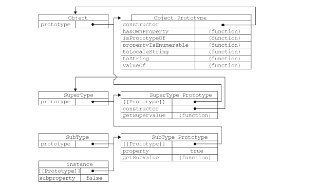

# 揭秘 JS 之 继承 百万家产

继承是`OO`（面对对象）语言中最为人津津乐道的概念。许多`OO`语言都支持两种继承方式：接口继承和实现继承。接口继承只继承方法签名，而实现继承则继承实际的方法。

但是函数没有签名，所以`ECMAScript`中无法实现接口继承。`ECMAScript`只支持实现继承，而且实现继承主要是依靠原型链来实现的。

## 原型链

原型和原型链是比较重要的知识点，在我们后续的文章中会重点讲解。它主要是利用原型让一个引用类型继承另外一个引用类型的方法和属性。

```js
function B() {}
B.prototype.say = function(){
    console.log(this.a)
}
B.prototype.a = 123;

var b = new B();

b.__proto__ === B.prototype // true

function C(){}

C.prototype = new B();
C.prototype.a= 321

var c = new C();

c.a // 123
c.say()

// C.prototype.__proto__ === B.prototype
```
以上代码，`C`的原型通过赋值为`B`的实例从而达到了继承的效果。

我们并没有使用`C`默认提供的原型，而是给它换了一个新的原型（`B`的实例）。于是，新的原型不仅具有作为 `B`的实例所拥有的全部方法和属性，而且同时其内部还有一个指针，指向`B`的原型。

但是`C`的实例`c`的构造函数并不是指向`C`，而是指向`B`。因为在`C.prototype = new B();`时`constructor`会被重写。

### 默认的原型

当我们实例化构造函数时会发现它可以使用`toString`等等的方法。因为它继承了来自`Object.prototype`上的`toString`默认方法。
所以所有的构造函数的原型都被继承`Object`原型上的方法和属性。这便形成了一条原型链



### 确定原型和实例的关系

第一种方式是使用`instanceof`来测试实例和原型链出现的构造函数的关系。

```js
console.log(c instanceof C);  // true
console.log(c instanceof B); // true
console.log(c instanceof Object);  // true
```

因为`C B Object` 之间存在继承和被继承的关系，所以`c`都是他们的实例

第二种方式是使用`isPrototypeOf`方法。同样，只要是原型链中出现过的原型，都可以说是该原型链所派生的实例的原型。

```js
console.log(Object.prototype.isPrototypeOf(c)); // true
console.log(B.prototype.isPrototypeOf(c)); // true
console.log(C.prototype.isPrototypeOf(c)); // true
```

### 

## 借用构造函数

这是一种比较经典的继承方式。

```js
   function B() {
    this.a = 123
    this.say = function() {
      console.log(this.a)
    }
  }

  function C() {
    B.call(this)
  }

  var c = new C()

  c.a // 123
  c.say() // 123
```

以上代码，我们通过`call`改变构造函数`C`中的上下文的方法来实现了继承。虽然实现了继承，但是我们也将无法避免构造函数模式下的存在的问题
：方法和属性都在构造函数内部定义，所以函数的复用就无从谈起了。同时我们也无法判断方法和属性的来源，无法看出父子关系。

## 组合继承

原型链继承可以很好的继承构造函数的原型方法和属性，形成链式关系。但是它无法实现继承构造函数内部的方法和属性。组合继承可以很好的解决这个问题。

```js
function B(name){
    this.name = name
}
B.prototype.say = function(){}

function C(name, age) {
    B.call(this, name)
    this.age = age;
}

C.prototype = new B();

var c = new C('lqy', 26);
```

## 原型式继承

## 寄生式继承

## 寄生组合式继承

## class 继承

对比以上6种继承方式，`class`的继承会清晰方便很多。

```js
class B {
    constructor(name) {
        this.name = name;
    }
    
    toString() {
        alert(123)
    }
}

class C extends B {
    constructor(name, age) {
        super(name); // 调用父类的 constructor(name)
        this.age = age;
    }
    
    toString(){
         super.toString(); // 调用父类的toString()
    }
}
```

子类`C`必须在`constructor`方法中调用`super`方法，否则新建实例时会报错。只有调用`super`之后，才可以使用`this`关键字，否则会报错。

```js{10}
class Point {
  constructor(x, y) {
    this.x = x;
    this.y = y;
  }
}

class ColorPoint extends Point {
  constructor(x, y, color) {
    this.color = color; // ReferenceError
    super(x, y);
    this.color = color; // 正确
  }
}
```

最后， 父类的静态方法，也会被子类继承。

### `Object.getPrototypeOf()`

`Object.getPrototypeOf` 方法可以用来从子类上获取父类

```js
Object.getPrototypeOf(ColorPoint) === Point
// true
```


