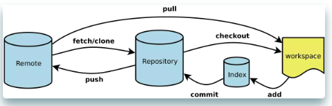
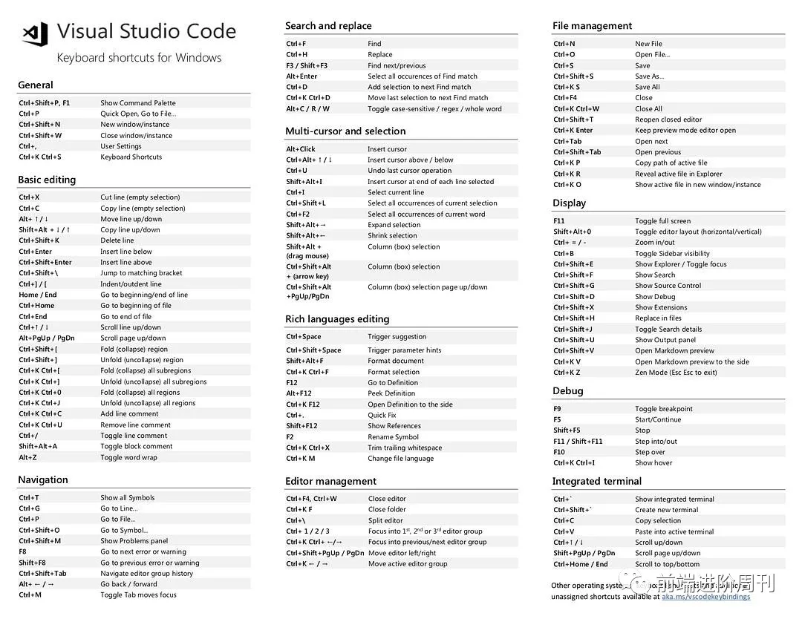
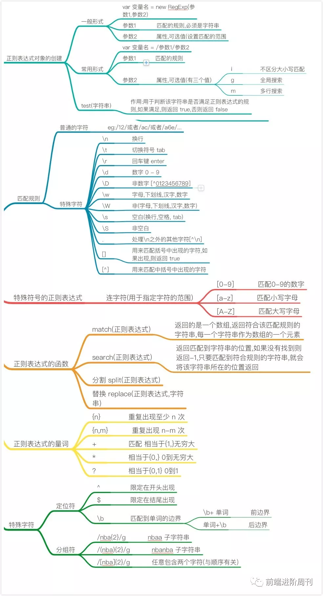

<!--
 * @Description: 快看，前端开发者都收藏了这几张图表！
 * @Author: liuqiyu
 * @Date: 2019-11-08 15:08:01
 * @LastEditors: liuqiyu
 * @LastEditTime: 2019-11-08 15:20:41
 -->
# 快看，前端开发者都收藏了这几张图表！

## Git命令

* workspace：工作区
* index/stage： 暂存区
* repository： 仓库区（本地仓库）
* remote: 远程仓库

## Vscode快捷键

## 正则

## 新手词汇

