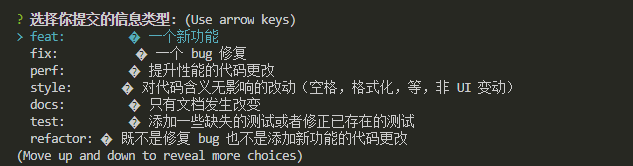
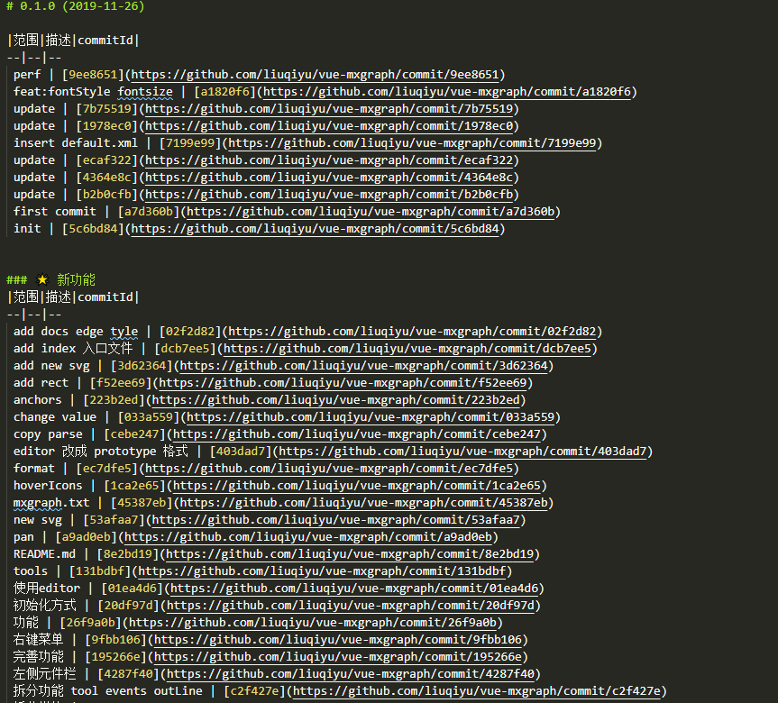

<!--
 * @Description: Git Commitlint
 * @Author: liuqiyu
 * @Date: 2019-11-26 15:04:35
 * @LastEditors: liuqiyu
 * @LastEditTime: 2019-11-26 15:20:38
 -->
# Git Commitlint

## 开篇

上一章写了`Git`的如何使用`Git hooks` 检测提交代码的规范性，这篇文章在之前的基础上加了注释的功能。

在团队中代码提交（git commit）会有各种各样的风格，甚至有些人根本没有 commit 规范的概念，所以在我们回头去查找在哪个版本出现问题的时候，就会非常尴尬😅，很难快速定位到问题。为了项目的规范化，代码提交规范就显得尤为重要！下面是我做的代码提交规范插件 `vue-cli-plugin-commitlint`（对 `conventional-changelog-angular` 进行了修改/封装）。开箱即用！

## 功能

* 自动检测 commit 是否规范，不规范不允许提交
* 自动提示 commit 填写格式。不怕忘记规范怎么写
* 集成 git add . && git commit 不需要在执行两个命令
* 自动生成 changelog

## 配置

```bash
npm i vue-cli-plugin-commitlint commitizen commitlint conventional-changelog-cli husky -D
```

在 `package.jso`n 中添加:

```json
{
  "scripts": {
    "log": "conventional-changelog --config ./node_modules/vue-cli-plugin-commitlint/lib/log -i CHANGELOG.md -s -r 0",
    "cz": "npm run log && git add . && git cz"
  },
  "husky": {
    "hooks": {
      "commit-msg": "commitlint -E HUSKY_GIT_PARAMS"
    }
  },
  "config": {
    "commitizen": {
      "path": "./node_modules/vue-cli-plugin-commitlint/lib/cz"
    }
  }
}
```

增加 commitlint.config.js 文件

```js
module.exports = {
  extends: ['./node_modules/vue-cli-plugin-commitlint/lib/lint']
};
```

## 使用

```bash
npm run cz  # git add . && git commit -m 'feat:(xxx): xxx'
npm run log # 生成 CHANGELOG
```

### Commit



### Change log



## 规则

规范名 | 描述
---|---
docs | 仅仅修改了文档，比如 README, CHANGELOG, CONTRIBUTE 等等
chore | 改变构建流程、或者增加依赖库、工具等
feat | 新增 feature
fix | 修复 bug
merge | 合并分支
perf | 优化相关，比如提升性能、体验
refactor | 代码重构，没有加新功能或者修复 bug
revert | 回滚到上一个版本
style | 仅仅修改了空格、格式缩进、都好等等，不改变代码逻辑
test | 测试用例，包括单元测试、集成测试等
